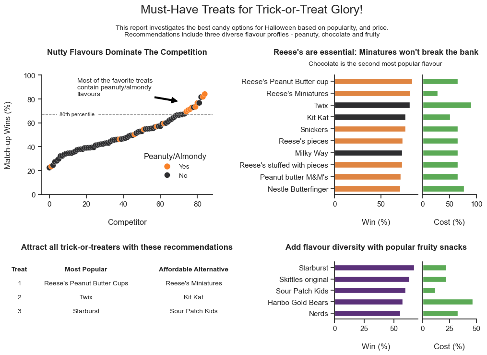

# Exploring Halloween Candy with Python

A jupyter notebook to discover which halloween candies will guarentee trick-or-treater satisfaction.

After exploration a single-page report was generated to highlight important features.

## Preview

### Skills Showcase

- Data Exploration
- Report development
  - matplotlib gridspec
- Multiple visualization tools
  -	Bar chart
  -	Scatter plots

## Tools used
Python
-	Pandas - For data manipulation
- Seaborn - For data visualization
-	Gridspec - For report building
  
## Author
kieswetter-hub
